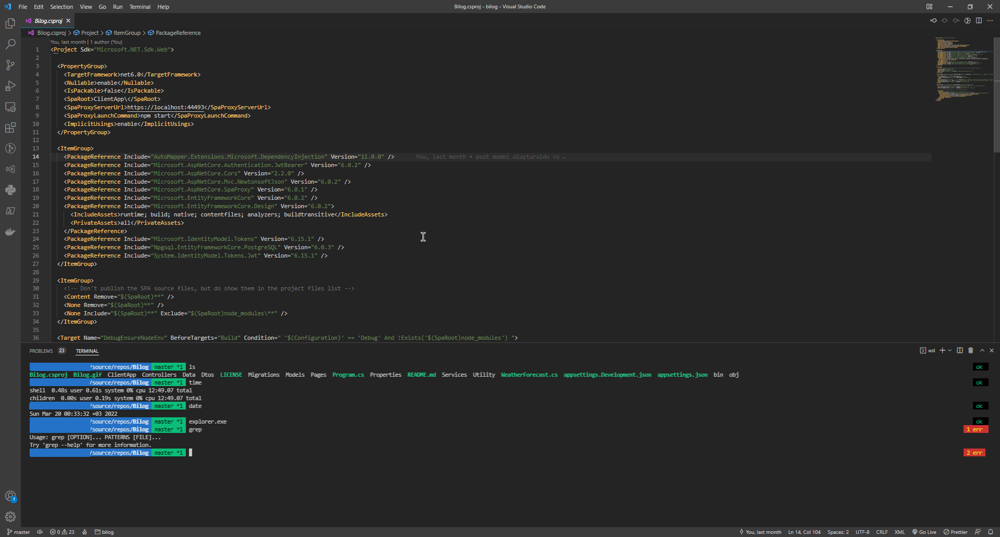
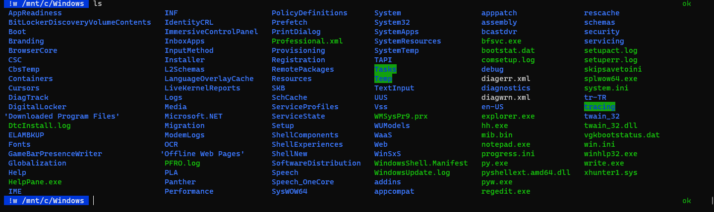
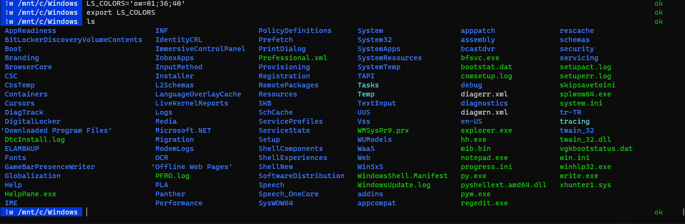

# Install ZSH on Windows Computer


- Install WSL https://docs.microsoft.com/en-us/windows/wsl/install
- Install Ubuntu from Windows Store. https://www.microsoft.com/store/productId/9PDXGNCFSCZV 
- Run Ubuntu and configure for the first time. On Ubuntu: 
    - `sudo apt install zsh`
    - Install oh-my-zsh from https://github.com/ohmyzsh/ohmyzsh
    - Clone my oh-my-zsh-config from https://github.com/bilalbozkurt/oh-my-zsh-config
    - Type `nano .zshrc` and edit this line with your username: `export ZSH="/home/`**bilal**`/.oh-my-zsh"` 
    - Copy `.oh-my-zsh` and `.zshrc` to `~/`
    - Clone powerlevel10k 
        ```
        git clone --depth=1 https://github.com/romkatv/powerlevel10k.git ~/powerlevel10k
        echo 'source ~/powerlevel10k/powerlevel10k.zsh-theme' >>~/.zshrc
        ```
    - To make ZSH default shell, type `nano ~/.bashrc` and add following lines to the beginning:
        ```
        #Launch ZSH
        if [ -t 1 ]; then
        exec zsh
        fi
        ```
- On Windows, install Windows Terminal https://www.microsoft.com/en-us/p/windows-terminal/9n0dx20hk701
- Open Terminal -> Settings -> Profiles -> Add a new profile -> Select Ubuntu or WSL -> Duplicate
- Change name and tab title to `ZSH`
- Run a ZSH shell. 
- Type ``ls`` 

- Let's remove unreadable bright highlights.
    ```
    LS_COLORS='ow=01;36;
    export LS_COLORS
    ```
- Type ``ls`` again.

- But it is not permanent. Let's make it permanent.
- Type `nano ~/.zshrc` and add following lines after `export ZSH="..."`
    ```
    #Remove LS directory highlights
    LS_COLORS='ow=01;36;'
    export LS_COLORS
    ```
- Make the shell default

## Remarks
- Your installed apps on Windows will work but you need to specify its extension.
    - eg. `dotnet` command will return an error but `dotnet.exe` command won't.
    - With this trick you can combine Windows commands and Linux commands together. Try `ipconfig.exe | grep IPv4` Further reading: https://docs.microsoft.com/en-us/windows/wsl/release-notes#build-14951
- It uses Windows Subsystem for Linux (WSL) and its shell.

